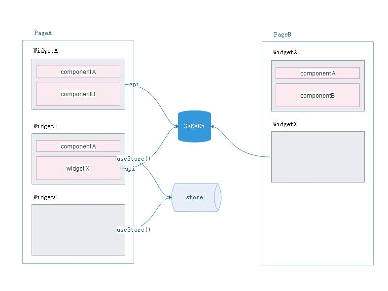

# 概述

招商多端小程序, 基于京东taro框架

1. baidu app, 成都家具网001:cdjjw001


## 目录结构
```
src
  --config 配置目录
  --models 全局状态, 基于dva
  --components 公用组件库
  --pages 页面
  --router 页面路径定义
  --utils 常用的工具类
```

## 编码规范



ui层页面构成

1. page, 用户访问的页面, 
    1. 负责获取请示参数
    2. 负责调用widget组件
    3. 不负责api数据获取(特殊情况除外)
    3. 不负责具体业务渲染
2. widget, 业务逻辑组件, 可以单页或多页共享
    1. 负责根据属性调用数据
    1. 负责使用store获取或设置跨页跨组件共享数据
    2. 负责使用components组件渲染数据
3. component, ui组件
    1. 负责根据属性数据渲染ui
    1. 负责调用onSomeEvent()方法回填组件更新数据
    2. 不负责数据获取
    2. 推荐使用
    
数据层构成

1. service, 对所有api的封装
2. store, 对共享数据的封装

配置
1. api path prefix
2. api header
3. constants 常量
4. 环境判断

## 效率
1. 制定规范及目录结构
1. css基础代码
    1. 字体
        1. 颜色
        2. 大小
        3. 对齐
        4. 截字
    2. 尺寸
    3. 边距
        1. margin
        2. padding
    4. 布局容器
1. js基础代码
    1. util
    2. user
    3. components
3. ide模板代码
4. jsx/template 代码
    1. 不允许代码实现复杂判断, 只渲染数据
    2. 重复代码抽象为函数生成
    
### Taro经验总结

1. 组件的渲染次数(最少两次)
    1. 使用默认值初次渲染, 不执行hook
    2. 获取route值之再次渲染, 执行hook, 即构造函数会被执行两次, [参考](https://nervjs.github.io/taro/docs/best-practice.html#%E7%BB%84%E4%BB%B6%E7%9A%84-constructor-%E4%B8%8E-render-%E6%8F%90%E5%89%8D%E8%B0%83%E7%94%A8)
    2. 改变了props再次渲染, 改变state值再次渲染(setSomeVar((v) => newV))
    4. 父组件的更新, 会渲染所有引用的子组件
    5. 改变state不会立即触发渲染, 渲染可能会合并多次setState的改变
2. scrollView高度自适应
    1. 父级元素
        - height: 100vh; 整个页面高度
        - display: flex;
        - flex-direction: column;
    2. scrollView元素
        - flex: 1;
        - overflow: auto;
     3. 兄弟节点自然定义   
3. 函数式组件可变量, = classComponent.prototype
    - var x = useRef()
    - 使用 x.current
4. 函数式组件
    1. 复杂页面分段渲染, @see pages/find/widget/Filter.js
    1. 组件最好定义 defaultProps
    1. 事件绑定均以 on 开头
    1. 子组件传入函数时属性名需要以 on 开头
    1. 先处理好需要遍历的数组，然后再用处理好的数组调用 map 方法。
    1. map 循环时请给元素加上 key 属性
5. 常量的使用
    1. 多处使用的字串/数字/数组
    2. 类别数组元素使用对象, 如{id: int, name: string}替代单纯的 name:string
6. hook
    - 将状态及其计算, 脱离渲染ui组件内部之外, 以达代码重用
        - Hooks 使用上是一个逻辑状态盒子，输入输出表示的是一种联系, 跨域了时间维度的状态映射, 不单单是个运算表达式
        - 将一个函数定义的state, 拿去别的函数使用
        - 共享状态逻辑, 不同渲染
    ```
    # 自定义hook
    export const useSome = (init, deps) { 
        const [someVar, setSomeVar] = useState(init)
        const computerApi = (args) => {
            // computer args
            setSomeVar(rs)
        } 
        useEffect(() => {
            // do something with deps
            setSomeVar(rs)
        }, [deps])
        return [someVar, computerApi]
    }
    ```
7. 增加客户端标识
8. 增加客户端版本号
9. **公用js不能相互依赖在百度小程序中**
9. **切换nodeJs版本后要npm install, 最好不要与yarn混用**

# 参考
## React 基础知识

1. [React 哲学](https://zh-hans.reactjs.org/docs/thinking-in-react.html)
1. [状态提升](https://zh-hans.reactjs.org/docs/lifting-state-up.html)
1. [context](https://zh-hans.reactjs.org/docs/context.html)
1. [Hook](https://zh-hans.reactjs.org/docs/hooks-intro.html)
    1. useState(statInit|callable), 返回一个 state，以及更新 state 的函数
    2. useEffect(didUpdate, [varName,..]), 默认情况下，effect 会在每轮组件渲染完成后执行
    3. useReducer, useState 的替代方案。它接收一个形如 (state, action) => newState 的 reducer，并返回当前的 state 以及与其配套的 dispatch 方法
1. [高阶组件](https://zh-hans.reactjs.org/docs/higher-order-components.html)

其它知识点

1. [高阶组件](https://www.jianshu.com/p/0aae7d4d9bc1)
1. [高阶函数与柯里化](https://www.jianshu.com/p/4cf2f0ab201e)
1. [组件间抽象](https://www.jianshu.com/p/5853b5d9535f)
1. [es6 装饰器](https://www.jianshu.com/p/8745660de050)

## Taro框架


### [taro](https://taro.aotu.io/)
1. [最佳实践](https://nervjs.github.io/taro/docs/best-practice.html)
    1. [最佳实践 2](https://github.com/js-newbee/taro-best-practices)
    1. [组件 PropTypes 检查类型](https://nervjs.github.io/taro/docs/props.html)
    1. [设置组件 defaultProps](https://nervjs.github.io/taro/docs/best-practice.html)
    1. [预加载](https://nervjs.github.io/taro/docs/optimized-practice.html)
2. [异步](https://nervjs.github.io/taro/docs/async-await.html)
3. [小程序代码混写](https://nervjs.github.io/taro/docs/hybrid.html)
1. 页面参数 this.$router.params
2. [生命周期](https://nervjs.github.io/taro/docs/tutorial.html#componentwillmount)
3. [错误处理](https://nervjs.github.io/taro/docs/spec-for-taro.html#%E9%94%99%E8%AF%AF%E5%A4%84%E7%90%86)
1. connect(stat) => Input输入 => update() => dispatch(save())
1. [Hooks](https://nervjs.github.io/taro/docs/hooks.html)

### ui库

1. [官方组件库](https://taro-docs.jd.com/taro/docs/components-desc.html)
1. [官方ui库](https://taro-ui.jd.com/#/)
1. [colorUI库](http://taro-ext.jd.com/plugin/view/5d11c8d6799d01c46376e2d1)

### 状态管理

- [taro redux](https://taro-docs.jd.com/taro/docs/redux.html)
    - [redux](http://cn.redux.js.org/docs/basics/Store.html)
    - [example](https://github.com/js-newbee/taro-yanxuan)
- [laco](https://github.com/deamme/laco#readme)
    - [laco Example](http://taro-ext.jd.com/plugin/view/5cffb65d5067859c9f87b449)
- [DvaJs](https://dvajs.com/guide/develop-complex-spa.html#%E5%8A%A8%E6%80%81%E5%8A%A0%E8%BD%BDmodel) 
    - [理解Dva](https://dvajs.com/guide/fig-show.html#%E5%9B%BE%E8%A7%A3%E4%BA%8C-redux-%E8%A1%A8%E7%A4%BA%E6%B3%95)
    - [Dva Effect](https://dvajs.com/knowledgemap/#effect)
    - [Taro + dva start](https://www.forkjoin.org/2018/08-31-TaroDva/)
    - [Taro + dva start](https://juejin.im/post/5bb1766d5188255c3272cdd0)
    - [Taro + dva project](https://github.com/EasyTuan/taro-msparis)

#　Todo

1. formid处理 x
2. service共用 x
3. 重复api调用效率问题 x
2. 多端用户验证 x
    1. api
    2. 前端
3. 样式修复 x
    1. 找荐目
4. 下拉刷新优化没有更多数据提醒 x
5. h5端检查所有提交留言
6. 浮动图标 x
7. 顶部返回栏 x
8. 信息安全性
    1. api接口安全 x
    2. 防刷新安全 x
    1. 服务端登录token过期
